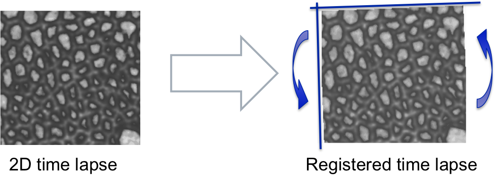

# Registration of Time Series #

---------------------------------------
##Summary##
If the sample is characterized by movement during the acquisition the time series can be corrected by aligning successive frames to the first.

---------------------------------------
##Assumptions##
The method assumes a 2D time series as input

---------------------------------------
##Options##

`Parameter: StackReg`

* Sends the time series to imageJ where the plugin StackReg is applied with a 'rigid' transformation model.
* Rigid: only translation or rotations i.e. no scaling
* **Attention:** make sure to allocate enough Java Heap Space in Matlab to be able to process the image
* Reference:
	* A Pyramid Approach to Subpixel Registration Based on Intensity P. Thévenaz, U.E. Ruttimann, M. Unser IEEE Transactions on Image Processing, vol. 7, no. 1, pp. 27-41, January 1998.
	* [StackReg website](http://bigwww.epfl.ch/thevenaz/stackreg/)

`Parameter: EpiTools's registration [beta]`

* This experimental registration method aligns the images in two steps:
	1. registration based on big features
	2. correction based on small features

---------------------------------------
######  Do you think these informations are not enough to help you? Drop a line to the author and he will extend this tutorial asap!

###### This page was written by [Davide Heller](mailto:davide.heller@imls.uzh.ch) on 10.09.14@17.08

