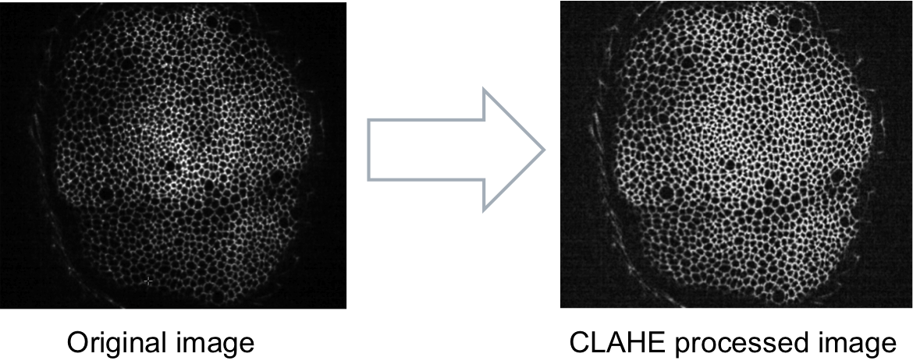

#Contrast limited adaptive histogram equalization#

---------------------------------------
##Summary##
Applies the matlab command **adapthisteq**®  to reduce contrast differences throughout  
the image. From the matlab documentation:

> CLAHE operates on small regions in the image, called tiles, rather than the entire image. Each tile's contrast is enhanced, so that the histogram of the output region approximately matches the histogram specified by the 'Distribution' parameter. The neighboring tiles are then combined using bilinear interpolation to eliminate artificially induced boundaries. The contrast, especially in homogeneous areas, can be limited to avoid amplifying any noise that might be present in the image

---------------------------------------
##Assumptions##
The method assumes 2D images in grayscale

---------------------------------------
##Parameters##

`Parameter: Enhancement limit`

* Real scalar in the range [0 1] that specifies a contrast enhancement limit. Higher numbers result in more contrast.
* *units* [positive real value]  
* *recommended range*: [0.01 0.05]

`Parameter: Enhancement width`

* Discribes the size of the tiles used by the clahe method
* *units* [pixels]  
* *recommended range* [20 30]  

---------------------------------------
######  Do you think these informations are not enough to help you? Drop a line to the author and he will extend this tutorial asap!

###### This page was written by [Davide Heller](mailto:davide.heller@imls.uzh.ch) on 10.09.14@17.08

