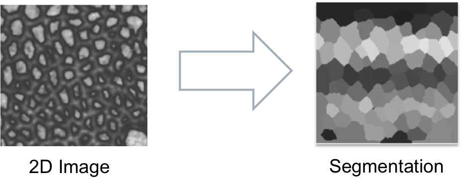

#Region growing segmentation#

---------------------------------------
##Summary##
Segmentation procedure to detect the individual cells in the image and find the boundaries with a seed based region growing algorithm.  

---------------------------------------
##Assumptions##
The input image is assumed to have high intensity membrane signal on low intensity background.

---------------------------------------
##Algorithm Steps##

###1.Seeding cells###

Detects individual cells by placing a seed for each cell region. Seeds are iteratively placed by raising an intensity level (low to high intensity). 
At the same time seeds are also grown into regions to detect whether an immediate neighbor region could be joined based on two thresholds.  
The first parameter to optimize for this step is the `Gaussian blur kernel`. After this the `minimum cell area` size and `minimal membrane intensity` can be modified
to reduce over-seeding of the cells.  
The reference figure when the debug option is active is _Figure 2: First seeding_.

`Parameter: Gaussian Blur Kernel`

* Initial gaussian blur to reduce the the sensitivity of the seeding
* Increasing the kernel size reduces the number of seeds while reducing it increases them. Given the removal steps to follow it is better to slightly overseed the cells.
* *units* [scalar]  
* *recommended range* [0-5, decimals]

`Parameter: Minimum cell area`

* Area threshold to merge touching regions with insufficient cell area.
* The higher the threshold the more cells will be merged in the beginning because of insufficient size.
* *units* [pixels]
* *recommended value* [20]

`Parameter: Minimal membrane intensity`

* Intensity threshold up to which regions which touch are merged, i.e. the membrane/boundary intensity is insufficient for two independent cells.
* The higher the threshold, the more seeds will be initially merged.
* *units* [intensity/pixel value]
* *recommended value* [20]

###2.Merge Seeds###
Regions which touch with a low boundary signal after the initial seeding are analyzed to avoid seeding a cell multiple times.
 The regions of the initial seeds are used to analyze the boundary signal.  
 The reference figure when the debug option is active is _Figure 3: Seeding after merging_.

`Parameter: Boundary Low Intensity Ratio`

* Percentage of pixels in the boundary below the following intensity threshold
    * *seedIntensity + std(cell background)/2*
* e.g. ratio = 0.35: 35% of the pixels in the boundary have a value lower than the threshold above.
* *units* [-]  
* *recommended value* [0.35]

###3.Region growing###
Segmentation algorithm to find the cell boundaries starting from the seeds. The strategy is very similar to the watershedding algorithm.  
The reference figure when the debug option is active is _Figure 4: First cell boundaries_.

`parameter: Gaussian Blur Kernel`

* Gaussian blur to reduce intensity fluctuations that could affect the segmentation algorithm.
* The higher the kernel the less segmented the image will be washing out weak membrane signal.
* *units* [scalar]  
* *recommended range* [0-5, decimals]

###4.Bad region removal###
Method to avoid false positives, i.e. regions with insufficient boundary signal or that are too large to be a cell. 
This applies especially to outer regions that have not been correctly detected.  
The reference figure when the debug option is active is _Figure 5: Boundaries after poor cell removal_

`parameter: Largest Cell Area`

* An upper threshold to how big a cell can be. 
* If a cell region region is greater it is removed.
* *units* [pixels]
* *default value* [3000]

`parameter: Minimal mean intensity`

* A lower threshold to the minimal mean intensity on the boundary of a cell
* If a cell has a lower mean intensity on it's boundary than the threshold it is eliminated
* *units* [intensity]
* *default value* [30]

---------------------------------------
### Additional Parameters ###

`parameter: Use Clahe Image`

* The segmentation will use the image processed with CLAHE
* In order to run, this option requires that the [clahe module](../02_clahe) was executed beforehand
* Activate this option when an uneven background illumination induces a poor segmentation performance

---------------------------------------
### Debug ###

* Set the debugging flag to view intermediate results (**Attention** use preferably in test mode)

---------------------------------------
######  Do you think these informations are not enough to help you? Drop a line to the author and he will extend this tutorial asap!

###### This page was written by [Davide Heller](mailto:davide.heller@imls.uzh.ch) on 30.09.14@15.38

