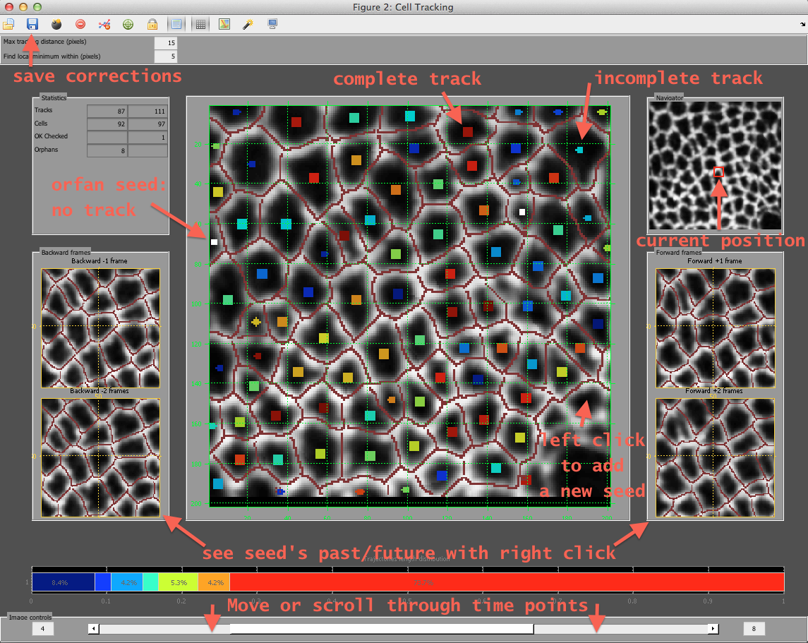

#Tracking Corrections#

---------------------------------------
##Summary##

This module helps to reduce the amount of segmentation errors in the image by tracking all cell seeds throughout every frame. The GUI shows the seeds and the cell boundaries obtained from the segmentation module and uses the registered image as background.

---------------------------------------
##Assumptions##

Incompletely tracked cells are often due to segmentation mistakes which can be corrected by manual supervision. Manual intervention is currently defined as placing and removing seeds by simple clicking actions. The algorithm will automatically recalculate the trajectories when a modification occurs.

---------------------------------------
##Parameters##

`Parameter: Tracking Radius`

* Defines the maximal distance which every cell is allowed to travel from frame to frame
* This parameter limits the 
* *units* [pixels]
* *default value*: 15 

---------------------------------------

##Usage##

* Working modes
	* `Overview`
		* Default visualization which gives the user an overview of the sample.
	* `Zoom`
		* Upon clicking on the overview the image will changed into a close-up (zoom) of the sample. Only here it is possible to manually edit the seeding.
		* Trajectories are each assigned an individual color
			* *Larger seeds* are correctly tracked
			* *Smaller seeds* have an incomplete track
				* a mark on the right signals a problem towards the end of the time lapse
				* a mark on the left signals a problem towards the beginning of the time lapse

* Main Interactions
	* `Switch working modes`
		* Click on the portion of the overview to work on
		* Press the space bar to return to the overview.
	* `Add or delete seeds`
		* For this action the zoom mode must be active
		* Click on an empty region to add a seed
		* Click on a present seed to remove it
	* `Move in time`
		* scroll with mouse
		* right/left arrows
		* slider
	* `Inspect incomplete track source`
		* press _i_ (Inspect) and click on an incomplete seed (small) to be guided to the frame where the tracking is incomplete.
	* `Accept incomplete track`
		* Division, Eliminations as well as poor imaging may require to leave a track incomplete. 
		* To mark the seed as reviewed press _o_ (Ok) and click on the incomplete seed.
		* The seed will be crossed by a horizontal bar to visualize the action.
	* `Save`
		* To save the progress at any time press _s_
		* A file containing the modifications will be saved into the analysis directory with a time stamp

* Advanced Interactions
	* `Hide segmentation`
		* review the underlying image by pressing _h_ (hide), press again to show
	* `Delete track`
		* delete an entire cell track by pressing _t_ (Track deletion) and clicking on the seed

---------------------------------------
######  Do you think these informations are not enough to help you? Drop a line to the author and he will extend this tutorial asap!

###### This page was written by [Davide Heller](mailto:davide.heller@imls.uzh.ch) on 30.09.14@17:30

