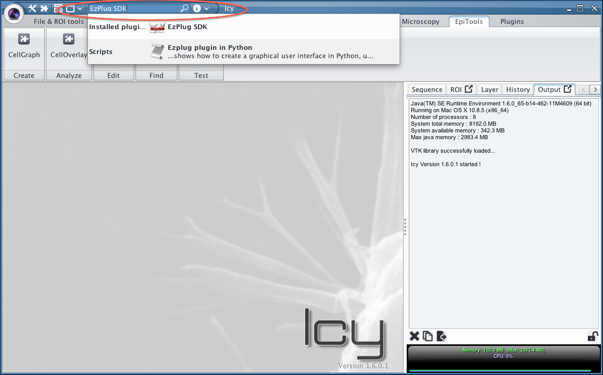
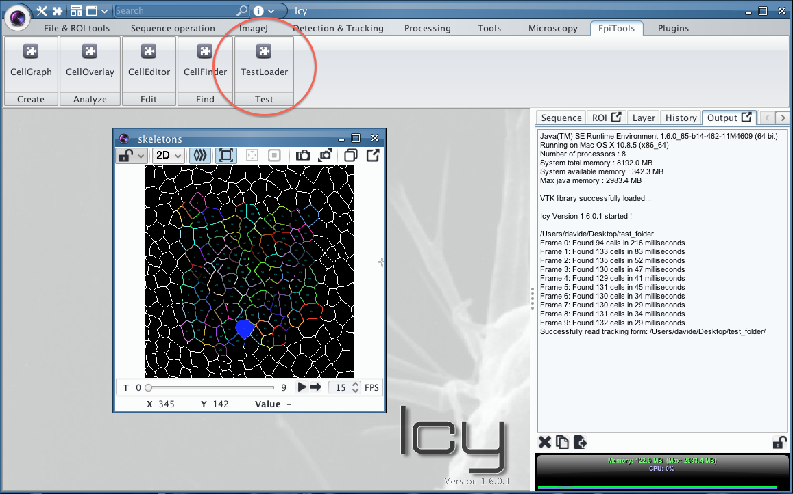

# Installation of the EpiTools plugins for ICY
---

Welcome to the EpiTool plugins for ICY. This collection of plugins for the <a href="http://icy.bioimageanalysis.org" target="_blank">bioimaging platform icy</a> allows to transform skeleton images into interactive overlays to explore and analyze your data. 

	Warning: if your icy background appears black instead of grey, the plugins will be affected an unsolved memory leak. Most reported cases appear in co-occurrence with Apple Retina® screens.
	
	Temporary Fix: Use an external monitor with the macbook lid closed   

### Download & Move the files in the right place
---

1. Download the package cellGraph.zip from [here](https://github.com/epitools/epitools-icy/releases)
2. Extract the package
3. Place the plugin **_folder davhelle_** into the icy plugin folder (e.g. programs/icy/plugins)
4. Place the workspace file **_EpiTools.xml_** into the icy workspace folder (e.g. programs/icy/workspace)
5. The **_folder test_** does not require any particular location

To update just replace the cellGraph_v#.#.#.jar in the plugin folder davhelle

### Enable the EpiTools Workspace in Icy
---

In order to add the EpiTools toolbar to your icy installation

1. Enter the preferences (icy logo > preferences) 
2. Go to _local workspace_ menu 
3. Enable the EpiTools workspace by checking the tickbox (see image below)
4. Confirm by clicking _Ok_, you will be asked to restart icy to apply the changes.

After the restart should see the following screen when opening icy and selecting the Epitools Bar.

### Install the required plugins for icy
---

In order to run the EpiTools plugins, only one additional icy plugin is required, [EzPlug](http://icy.bioimageanalysis.org/plugin/EzPlug_SDK). This is a plugin which facilitates the building of graphical user interfaces and is used by all EpiTools Plugins. To install it simply write in the icy search field the following plugin name [network connection required]:

* EzPlug SDK (most likely already installed)
* 3D Mesh ROI (only for the CellSurface plugin)

### Test if the installation was successfull
---
To test the installation:

1. Run the **TestLoader** Plugin in the EpiTools Bar/or through the search bar
2. You will be asked to locate the **folder test** from the download package
3. Shortely after a new viewer should be visualized (image below)
 
Learn about what can be done with it in the [next section](../01_CellOverlay)

 

### Installation video tutorial
---

For a complete installation of icy and CellGraph please watch our [video tutorial](https://www.dropbox.com/s/ajfhqeetxanw0l5/01_Plugin_installation.mov?dl=0)

---
######  Do you think these informations are not enough to help you? Drop a line to the author and he will extend this tutorial asap!

###### This page was written by [Davide Heller](mailto:davide.heller@gmail.com) on 27.03.2015@09:28

