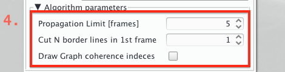
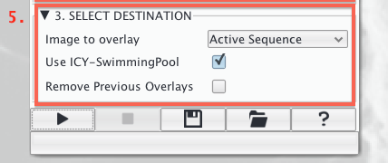

# Creating new Graphs with CellGraph
---------------------------------------

While the [CellOverlay](../01_CellOverlay) plugin generates the Overlays, it requires a graph structure in the shared plugin memory (also called _swimming pool_ in icy). Learn here how to transform your skeleton images into a graph structure using the CellGraph plugin.

For a general introduction to the CellGraph concept watch our [first tutorial video](https://www.dropbox.com/s/ahgcnho6mjit0z9/02_CellGraph_concept.mov?dl=0). Another video dedicated to how to import skeleton time series is available [here](https://www.dropbox.com/s/m1um7hdl26h5iqi/04_CellOverlay_introduction_area.mov?dl=0) too.

	Warning: 
	- Currently only one graph at the time is allowed in memory.
	- Currently only the following file pattern for time series is allowed: [name]_000.[ext]
	- Currently one skeleton file per frame is required, i.e. a multiple image tiff is not supported
	
--- 

To create a graph and load it into memory open the CellGraph plugin from the toolbar: 

### 1. Choose your Input files

Most importantly CellGraph needs files from which to extract the graph structure:

2. If your files are images/bitmaps the default _File type_ 'SKELETON' is correct
    * Alternative files are WKT & VKT, both text based
3. Choose your input file
	* If you want to load a time series select the _First time point_
    * Please notice the file name convention mentioned in the warning above
4. Set the number of _Time points to load_, to start it is recommended to try with 1 or 2

### 2. Review the secondary input options [optional]

In order to correctly analyze the input files CellGraph can be fine tuned for specific file types. By default CellGraph assumes to receive files which were directly exported from the EpiTools App for Matlab.

3. Click the _Packing Analyzer files_ if you used the software Packing Analyzer v.2-8 by (Aigouy et al. (2010)) for segmentation
	* In this scenario use the image as first file. Cell_Graph will use the /handCorrection.png as skeleton
4. Choose _Cut on border line_ to exclude the most outer cell layer from the analysis
	* This is advisable in case of poor performance at the segmentation boundaries
7. Choose _Remove very small cells_ to exclude cells below an area threshold automatically
	* e.g. avoid small segmentation artefacts to be recognized as cells

### 3. Choose if to track your skeletons

Tracking is only possible if a time series is given as inptut

8. The standard tracking _Algorithm_ is currently _STABLE_MARRIAGE_
	* Try the _HUNGARIAN_ type for a more robust algorithm to movement (time consuming!)
	
### 4. Review tracking options [optional]

Depending on the time series frequency and the segmentation quality it can be helpful to change the default paramenters of the tracking algorithm:

1. Change the _Propagation limit_ to amplify(+)/reduce(-) the number of previous frames that participate in the assignment of the track of a cell.
	* This is useful when the sample is subject to strong motion, a shorter limit will prove more effective
2. Change the _Cut N border lines in 1st frame_ to track only a core region of the sample
	* This is useful if the border region segmentation is poor. The algoritm will exclude _N_ border layers from the cell population in the first frame and track only the remaining inner cells.

### 5. Choose the Destination

The extracted graph structures are always used together with a background image. This image can be any image compatible (x, y,t) with the skeleton images, i.e. the original raw image / projected_image / second channel ecc

1. Choose _Image to overay_ from you active Sequences
	* The plugin requires an open image!
2. Deselect _Use ICY-SwimmingPool_ only to avoid overriding another structure in memory
	* This is due to a current limitation which allows only one graph in memory at a time
3. Select _Remove Previous Overlays_ if the destination image already overlays which are not needed anymore

### 6. Run the plugin

To generate the graph click on the triangle button on the lower-left of the plugin. During the Excecution the progress can be followed both in the status bar as well as in _Output_ tab. After excecution the first overlay will be displayed on the active sequence.

### Generated Result

In case of a _Single frame_ the found cell polygons with the centroids will be visualized (i.e. the _CELL OUTLINE_ overlay)

In case of a _Tracked time series_ cell the automatically generated overlay will be the _TRACKING_ one. Every cell is outlined by an individual color preserved through time and a filled with one of the following colors in case of a trackign event:

* [red] cell missing in previous frame
* [yellow] cell missing in next frame
* [green] cell missing in previous&next
* [blue] cell dividing in next frame
* [magenta] brother cell missing
* [cyan] cell eliminated in next frame
* [gray] brother cell was eliminated

---------------------------------------

######  Do you think these informations are not enough to help you? Drop a line to the author and he will extend this tutorial asap!

###### This page was written by [Davide Heller](mailto:davide.heller@imls.uzh.ch) on 29.04.2015@14:36

