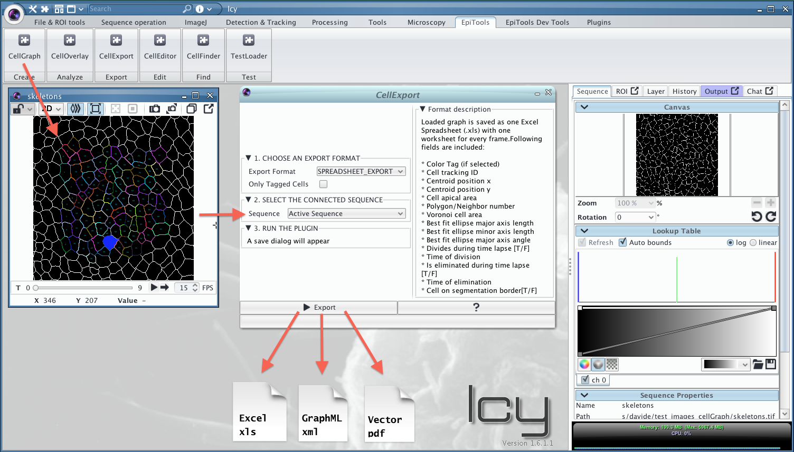
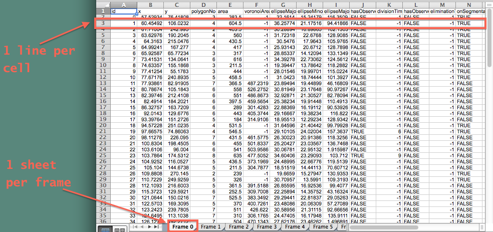
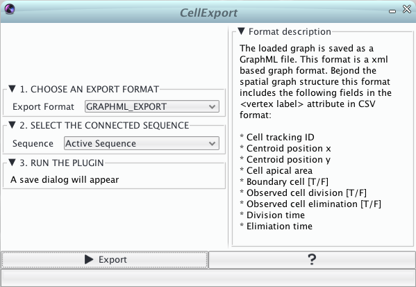
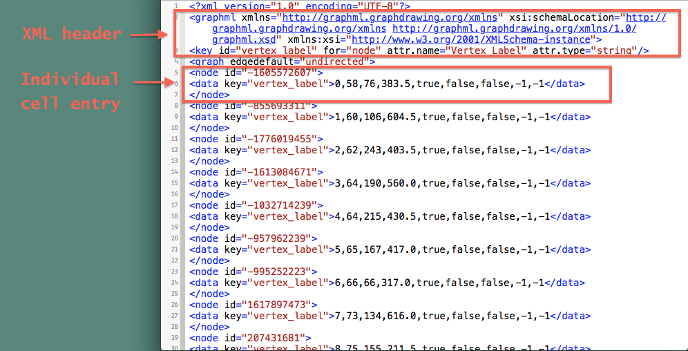
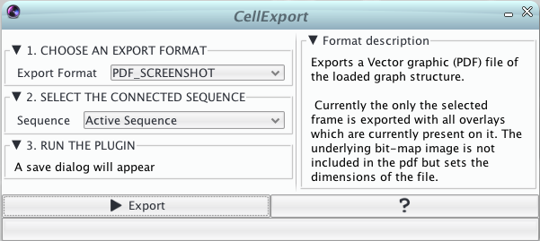

# Exporting data with CellExport
---------------------------------------

After generating a graph with [CellGraph](../02_CellGraph) and inspecting it with [CellOverlay](../01_CellOverlay), a remaining step is how to export quantitative information. 

The *CellExport* plugin can read a loaded graph structure and export the data contained in various formats. Currently the export is tied to an image sequence on which the graph is projected to have all the information necessary for a successful export.

Check out our [video tutorial for spreadsheet export](https://www.dropbox.com/s/y7o47iniq6g7s3w/11_CellExport_Spreadsheet.mov?dl=0) for a short overview.

	

### Export formats
--- 

### Excel Spreadsheet (*.xls)

The spreadsheet option couples most of the individual overlay exports into a single xls file. Each frame produces a separate sheet and contains the most important analysis features over every cell including:

* Cell tracking id
* Cell centroid (x,y) coordinate
* Cell area
* Polygon count / number of neighbors
* Voronoi area based on the voronoi tesselation generated from the cell's centroids
* Ellise fitting parameters
	* Major axis's length
	* Minor axis's length
	* Major axis's angle (i.e. cell orientation) 
* [TRUE/FALSE] value whether the cell has divided throughout the timelapse
* Frame number in which the cell divided (if)
* [TRUE/FALSE] value whether the cell was eliminated during the timelapse
* Frame number in which the cell was eliminated
* [TRUE/FALSE] value whether the cell is on the boundary of the segmentation

The _Only Tagged cells_ option enables to export only the cells marked through the _CELL COLOR TAG_ overlay. In this case every line will be preceeded by an additional column indicating the color tag. 

### GraphML (*.xml)

The limitation of spreadsheets is the difficulty to incorporate the graph structure of the tissue. For this reason we offer another export format called graphML. This XML based format saves the structure of the graph and can be extended through vertex attributes. To read more about the GraphML format we refer the reader to the following [GraphML website](http://graphml.graphdrawing.org) 

As attribute values we included similar features to the spreadsheet option:

* id,x,area,boundary,division,elimination, division_time, elimination time

The export will generate an individual graphml file for every frame (e.g. frame000.xml for frame0). Additionally to the separate graphML files, a header file is added to keep reference of the included attributes. Please make sure to select a new folder when choosing the destination location.

A small example for analyzing the files using the statistical computing language R can be found [here](http://imls-bg-arthemis.uzh.ch/epitools/files/samples/GraphML_example.zip).

Watch our [GraphML video tutorial](https://www.dropbox.com/s/m1mg7s03whhatn9/11_CellExport_GraphML.mov?dl=0) for more information.

### Vector graphic (*.pdf)

A still experimental feature is to generate vector graphics from the overlay. This plugin option generates a pdf file containing the overlays represented on the currently selected time point. This has proven to be useful especially for figure composition.

### Skeleton files (\*.tiff or \*.wkt)

* Selecting TIFF_SKELETONS exports the currently detected cells as TIFF images regardless of the input format given to CellGraph. This can be convenient in case you want to further edit your skeletons (e.g. the PNG skeletons returned by the EpiTools for Matlab) with [CellEditor](../04_CellEditor)

* Selecting WKT_SKELETONS exports the currently detected cells as [Well-Known text](https://en.wikipedia.org/wiki/Well-known_text) files which describe the individual polygons composing the images. These files cannot be further edited by Pixel based methods but allow a much faster import through CellGraph as well in other Geospatial softwares/libraries.

---------------------------------------

######  Do you think these informations are not enough to help you? Drop a line to the author and he will extend this tutorial asap!

###### This page was written by [Davide Heller](mailto:davide.heller@imls.uzh.ch) on 22.04.2016@17:45

