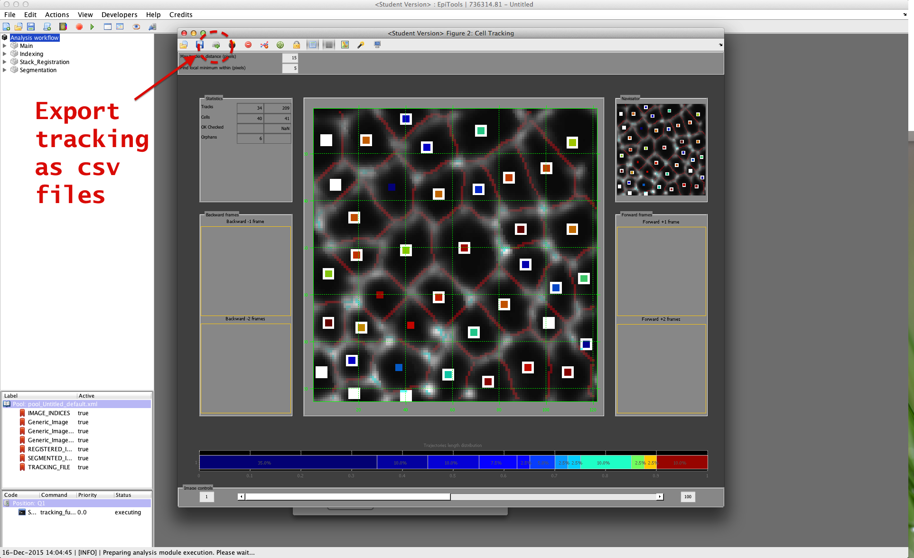
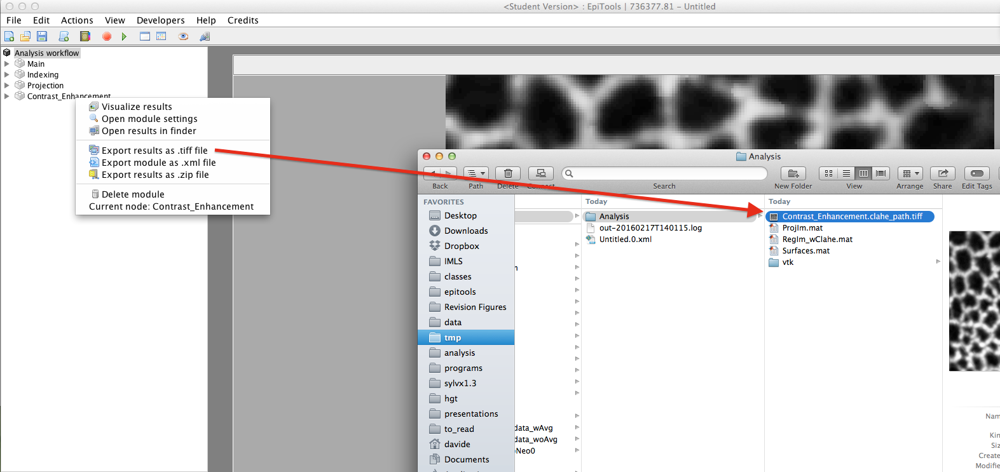

# Frequently Asked Questions
---

We have collated a linux virtual machine with all the requirements installed for epitools to work. Please, send an email to [Pablo Vicente Munuera](mailto:p.munuera@ucl.ac.uk) to request it.

### Which version of Icy works with Epitools?

Recently, we have identified an issue from Icy versions 2.1.X onwards. We highly recommend to use Icy version 2.0.3, which unfortunately may not work with some operating systems anymore. Drop us an email and we can provide you with a working Icy version and how to open it.

### Which Matlab versions do you support?

- Matlab 2013b and 2014a are the reference versions for which we support EpiTools for Matlab v2
- for Matlab versions prior to **2013b**: 
	- Due to dependencies on core functions which are only present from 2013b onwards we currently can't offer support for EpiTools for Matlab v2 on earlier Matlab versions.
	- Albeit not further maintained you can still download our previous version ([EpiTools for Matlab v1](https://github.com/epitools/epitools-misc)) which has been successfully tested on Matlab 2012b. As for time of writing (January 2016) v1 has only a slightly more reduced GUI functionality (limited comparison mode and viewing mode) but offers all modules as EpiTools for Matlab V2 as well as a command line access (you can find a sample script in the main directory).

- for Matlab versions after **2014a**: 
	- With the release of Matlab version 2014b Mathworks changed the GUI system, which we had leveraged on to build the EpiTools for Matlab GUI, and how java programs are interfaced with it. Adapting to these changes and keeping the retrocompatability requires a major change in the code and we currently evaluating several options as solution. 
	- Feel free to write us if you have suggestions or comments on how to solve the compatability with future Matlab versions.

### Which Matlab toolboxes are required?

- Image Processing Toolbox
- Statistics Toolbox

### Is parallel computing supported?

- Currently (v.2.1.5) **parallel computing support is broken** due to a software regression and the challenge to support multiple Matlab versions, which handle Matlab workers differently.
- Please do not change the default number of Processors unless you are making custom modifications to the code.
- Notice: The Parallel Computing Toolbox is required for this feature

### Why are there two tracking algorithms in EpiTools?

- The tracking algorithm in EpiTools for Matlab (i.e. the assisted correction step) is optimized to be fast in order to allow a fluent user interaction. This means that it does not extract any information about divisions or eliminations or resist stronger time shifts. This is why we build a more elaborate algorithm in icy. 
- The graph matching algorithms included in EpiTools for Icy are able to detect divisions and eliminations as well as resist better to local movement (e.g. swapping). So whenever the icy tracking is viable we recommend it. The included variants ("stable marriage" and "hungarian") apply the same weighing schemes but differ in the way the optimal matching is computed, the hungarian being more global oriented and thus more time-consuming.
- Nevertheless, if the Matlab tracking is preferred, you can export the tracking information by clicking on the 3rd icon from the right in the tracking GUI (see screenshot [1]). The generated csv files can be imported in icy (see screenhot [2]).

### Is it possible to apply the same projection to another image channel

- Unfortunately this is currently not possible through our GUI but if you are fine with using the Matlab command line you can use the Surfaces.mat (2nd output of the Projection step) file to do it. The latter stores the z-origin number of every pixel in the projected image. We provide a small example script that shows how to apply it to an indivual time point. You can download it [here](https://github.com/epitools/epitools-misc).

### How to export the result of an intermediate step as tiff image

- You can export images as tiff through the context menu, by clicking on the relative item in the left panel and selecting the TIFF export option. (See screenshot below for the clahe step)

- Alternatively you can also send the images directly to icy from matlab, for this method you can find more information in Quick Guide [Connecting icy](../Quick_Guide/04_Connecting_icy).

---
This page was written by [Davide Heller](mailto:davide.heller@gmail.com) on 05.02.2016@15:30

